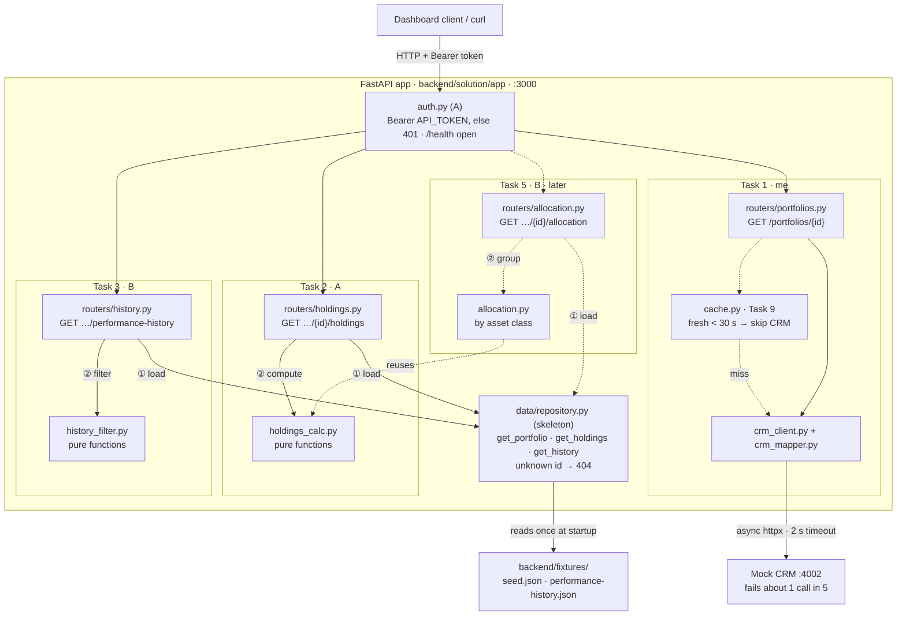
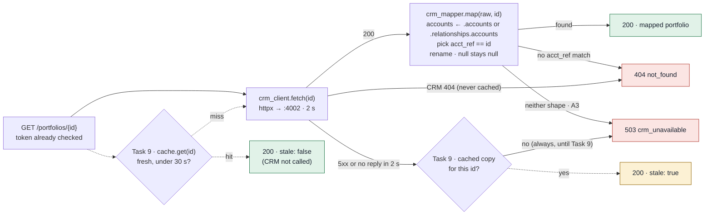
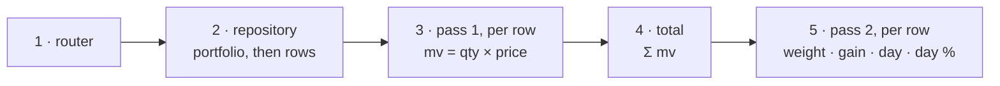
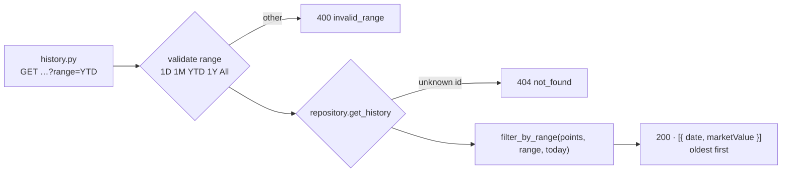

# ARCHITECTURE: Portfolio API, Tasks 1–3

How a request moves through the backend for the first three endpoints, built in parallel as vertical
slices. Follows BRIEF.md §6–§8; if the two disagree, BRIEF.md wins. Diagrams are Mermaid (GitHub
renders them). Visual version: https://claude.ai/artifact/AvG2oPk61AuAuGyWCN3KdW

**Owners:** me = Task 1 → 9 · partner A = skeleton, Task 2, Task 4 · partner B = Task 3 → 5.
Dashed = later work (Task 5, Task 9) that the first slices leave room for.

## 1. The service at a glance

- Each slice owns one router and one service file. The only shared file is `main.py`: one
  `include_router` line per slice.
- Task 1 is the only endpoint that reads the CRM. Every other endpoint reads seed data through the
  repository.
- Routers do no maths: load data (①), pass it to a pure function (②), return JSON. The maths is
  unit-tested without a server.

## 2. Task 1 · `GET /portfolios/{id}`: every way the CRM call can end

- Two routes to 404: the CRM has no such account, or it returns the client's accounts and none match
  `acct_ref`. P-9002 tests the second (the CRM lists P-9001 first).
- Build Task 1 so failures end in 503. Task 9 only adds the dashed parts: the fresh-hit shortcut and
  the stale fallback.
- The 2 s timeout stops the CRM's 10 s `timeout` mode from hanging the request.

## 3. Task 2 · `GET /portfolios/{id}/holdings`: two passes over the rows

| Step | Sample (P-9001) | Edge cases |
|---|---|---|
| 2 · repository | AAPL 120 @ 227.50 · BND 300 @ 72.10 · ZERO 0 @ 12.00 | unknown id → 404 · P-EMPTY → `[]` |
| 3 · pass 1 | AAPL 27,300.00 · BND 21,630.00 · ZERO 0.00 | qty 0 → mv 0 |
| 4 · total | 48,930.00 (matches CRM `curr_val`; Task 5 reuses it) | total 0 → weights 0 |
| 5 · pass 2 | AAPL w 0.557940 · BND w 0.442060 · ZERO all fields 0 | NEW prevClose 0 → day % `null` (A2), day change still 500.00 |

Weight needs the total, and the total needs every row's market value, so there are two passes. Stay
unrounded through both; round money to 2 dp only when the response is built. Weights are not forced
to add up to 1.

## 4. Task 3 · `GET /portfolios/{id}/performance-history`: validate, load, cut

Windows are inclusive and counted back from `today`, which the router passes in so tests can fix the
date. Counts below assume history regenerated on 2026-10-03 (P-9001 has 401 daily points from
2025-08-29):

| Range | First date | P-9001 points | P-9002 points (60 days of history) |
|---|---|---|---|
| All (default) | first point | 401 | 60 |
| 1Y | today − 1 year (2025-10-03) | 366 | 60, not padded |
| YTD | 1 Jan this year (2026-01-01) | 276 | 60 |
| 1M | today − 1 month (2026-09-03) | 31 | 31 |
| 1D | today − 1 day (2026-10-02) | 2 (yesterday, today) | 2 |

Range is validated before data loads, so `range=2Y` is 400 even for an unknown portfolio. Regenerate
history (`node backend/fixtures/generate-history.mjs`) on demo day so YTD uses the current year.

## 5. Responses per endpoint

| Endpoint | Reads | Owner | Responses |
|---|---|---|---|
| `GET /health` | nothing | skeleton | 200, no token needed |
| `GET /portfolios/{id}` | Mock CRM | me | 200 · 200 stale (Task 9) · 401 · 404 `not_found` · 503 `crm_unavailable` |
| `GET /portfolios/{id}/holdings` | seed.json | A | 200 (may be `[]`) · 401 · 404 `not_found` |
| `GET /portfolios/{id}/performance-history` | performance-history.json | B | 200 (may be `[]`) · 400 `invalid_range` · 401 · 404 `not_found` |

Every error body is flat: `{ "error": "<code>", "message": "<text>" }`. `errors.py` turns FastAPI's
422 into 400 and unhandled exceptions into a 500 with no stack trace.

## 6. Still to agree

1. A CRM reply with neither account shape → 503 (A3), not 502.
2. 1D returns two points (yesterday and today), per R5's "today − 1 day".
3. NEW's `dayChangePercent` is `null` in holdings while the CRM reports 0 for P-9002 (A2): document
   as a known mismatch.
